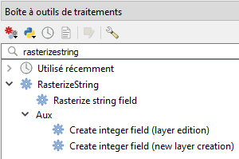
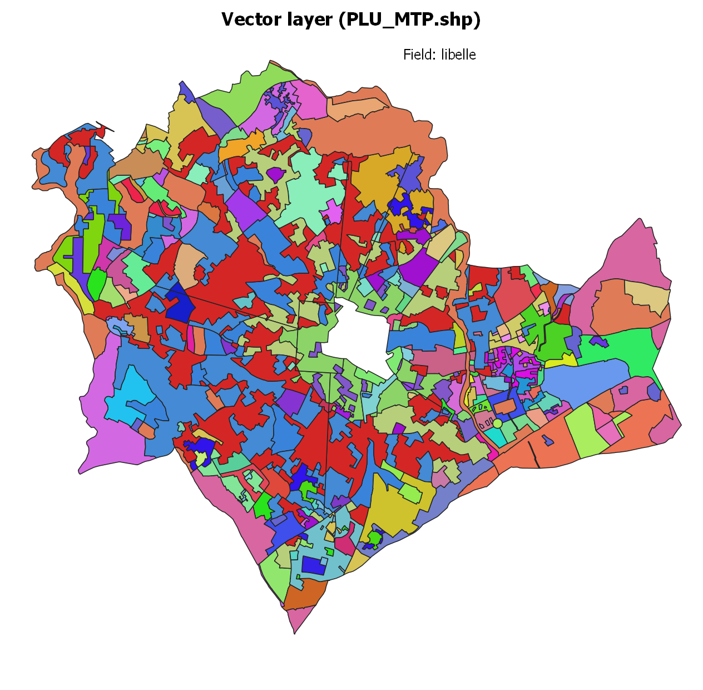
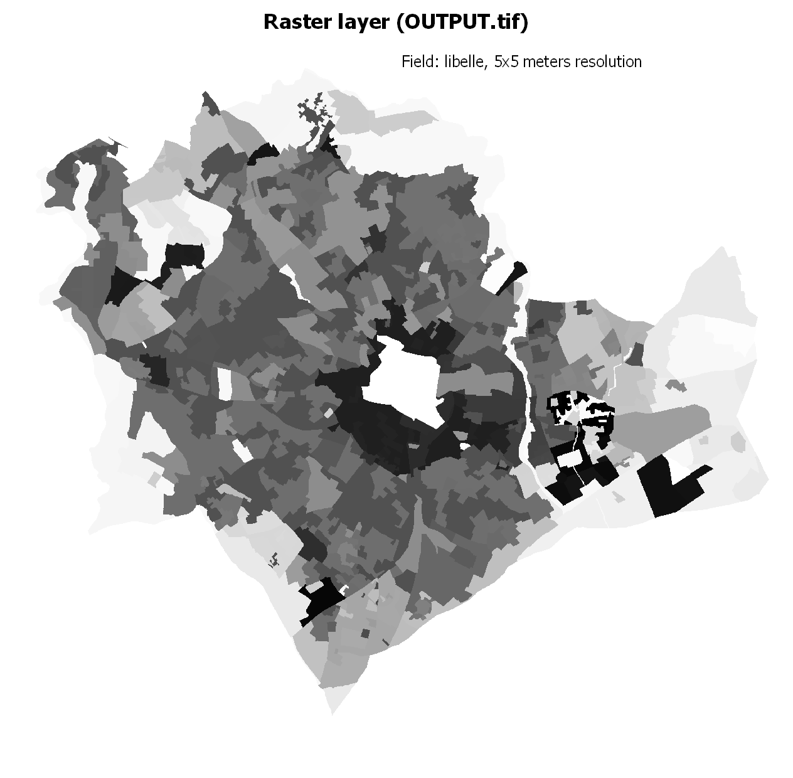
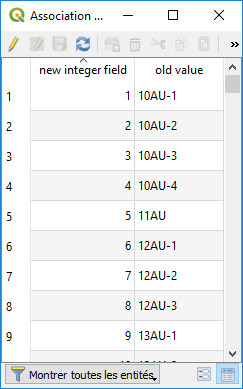

.. rasterizestring documentation master file, created by
   sphinx-quickstart on Sun Feb 12 17:11:03 2012.
   You can adapt this file completely to your liking, but it should at least
   contain the root `toctree` directive.

rasterizestring
============================================

QGIS processing algorithm to perform rasterization on non-numeric field.

**Classic use case** : vector layer containing string categories (such as land cover class descrptions) that you want to rasterize.
Untill now you had to manually create an integer field and then to call rasterize on this new field.
This time is over, just select your string field and *rasterizestring* will work for you.

Algorithm
_________

This algorithm is a wrapper of gdal rasterize that allows to specify a non-numeric field.

Output raster values are automatically generated according to input field values. A temporary integer field is created and a new integer value is associated to each input unique value (from 1 to N with N = number of unique values). Such association is loaded is CSV file 'Association.csv'.

Output data type is chosen according to data range (unsigned integer type of minimal range, e.g. Byte, UInt16 or UInt32).

*ALL_TOUCH* option can be activated also in graphical mode.

Requirements
____________

QGIS minimum version is 3.4.0

Installation
____________

Go to plugins menu, activate experimental plugins, search for *rasterizestring* and install it.

Open processing toolbox (*processing* menu if not already displayed), a new provider *RasterizeString* containing *Rasterize from string field* algorithm shall appear.

Sample data
___________

A layer is provided in *sample_data* directory containing fields of integer, string and date types but it should work on your own data.

Perspectives
____________

This is a first version designed as a simple wrapper but I am open to any ideas, please share your feedbacks and thoughts !!

Some points that could be explored:

* a new parameter to select input values that shall be transformed to *NoData* (such as *NULL* for instance)
* if selected field has integer type, shall *rasterize* be directly called ?
* how to manages dates ?
* legend creation
* QGIS 2 version
* Launch *rasterizestring* from *Raster* menu
* ...

Once again, this is a first try which aim is to adress this classic use case I've been (but not only me !) facing.

**Please share feedbcaks and contributions !!**!

